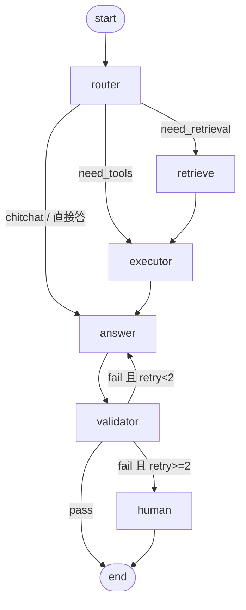

# Enterprise Agent · Day 2–5 技术方案

> 现状：Day 1 完成（FastAPI + SQLAlchemy 2.0 async + PG/pgvector + 8 张表 + /api/chat stub）。
> 本文定义 Day 2–5 的目标架构、文件清单、关键接口与每日验收标准。
> 已定选型：**LLM 走 OpenAI 兼容协议 + 自建 Provider 抽象层**（不引入 LangChain，Day 4 再引入 LangGraph 只做编排）。

---

## 0. 设计原则

1. **Provider 抽象先行**：业务代码只依赖 `LLMProvider` 接口，绝不直接 import SDK。换模型 / 换厂商 = 改配置 + 加一个实现类。
2. **结构化输出贯穿全链路**：所有需要机器判断的环节（意图、工具参数、校验结果）都用 Pydantic 模型承接，不用正则解析自然语言。
3. **图只做编排，不做业务**：LangGraph 的 Node 只负责调度，业务逻辑放在 `tools/` 与 `services/`，便于单测。
4. **工具声明式注册**：工具自带 JSON Schema，一份定义同时喂给 LLM 与参数校验。
5. **写操作一律人工确认**：查可以自动执行，改/退款/下单必须走 `human_handoff`。

---

## 1. 目标目录结构

```
app/
├── api/
│   ├── deps.py                 # 【D2】公共依赖：get_session / get_llm / get_retriever
│   ├── routes_chat.py          # 【D1→D2→D5】对话入口
│   ├── routes_documents.py     # 【D4】文档上传 + 入库 + 重建索引
│   └── routes_admin.py         # 【D5】人工确认回调、会话查询
├── core/
│   ├── config.py               # 【D1→D2】LLM / embedding 配置
│   ├── logging.py              # 【D2】structlog 结构化日志 + request_id
│   └── errors.py               # 【D2】统一异常与错误码
├── db/                         # 【D1】session / base / init_db / seed
├── llm/                        # 【D2 新增】
│   ├── base.py                 # LLMProvider 抽象 + ChatMessage / LLMResponse
│   ├── openai_provider.py      # OpenAI 兼容实现（异步）
│   ├── fake_provider.py        # 离线测试用，按意图返回固定结构
│   ├── factory.py              # 按配置返回 Provider 单例
│   └── errors.py               # LLMError / RateLimitError / ParseError
├── prompts/                    # 【D2 新增】
│   ├── system.py               # 企业助手人格与边界
│   ├── intent.py               # 意图识别提示词
│   ├── answer.py               # 带引用的回答生成
│   └── validate.py             # 【D5】答案校验提示词
├── schemas/
│   ├── chat.py                 # 【D1→D2】请求/响应
│   ├── intent.py               # 【D2】IntentResult 等结构化输出
│   ├── tool.py                 # 【D3】工具调用记录
│   └── document.py             # 【D4】文档与切片出入参
├── tools/                      # 【D3 新增】
│   ├── base.py                 # ToolSpec + @register_tool
│   ├── registry.py             # 注册表：to_openai_tools() / get() / run()
│   ├── business.py             # query_customer / query_order / order_statistics
│   └── retrieval.py            # 【D4】search_knowledge
├── rag/                        # 【D4 新增】
│   ├── loader.py               # pdf / md / txt / docx 解析
│   ├── chunker.py              # 按 token 窗口切分 + overlap
│   ├── embeddings.py           # batch embedding（OpenAI 兼容 / embeddings 接口）
│   ├── retriever.py            # 向量检索 + 元数据过滤 + 混合检索
│   └── index.py                # HNSW 索引 DDL 与维护
├── agent/                      # 【D4–D5 新增】
│   ├── state.py                # AgentState（TypedDict）
│   ├── nodes/
│   │   ├── router.py           # 【D5】意图 → 路由策略
│   │   ├── retrieve.py         # 【D4】知识检索
│   │   ├── executor.py         # 【D5】工具编排执行
│   │   ├── answer.py           # 【D4】答案生成
│   │   ├── validator.py        # 【D5】答案校验
│   │   └── human.py            # 【D5】人工确认挂起
│   ├── edges.py                # 条件边判断函数
│   └── graph.py                # 组装 StateGraph，编译导出
├── services/                   # 【D5 新增】
│   ├── conversation.py         # 会话与消息落库、历史窗口裁剪
│   └── memory.py               # memories 抽取与召回
└── models/                     # 【D1，D4 补 relationship + 向量索引】

tests/
├── conftest.py                 # fake provider / 内存依赖注入
├── test_llm_provider.py        # 【D2】
├── test_tools.py               # 【D3】
├── test_rag.py                 # 【D4】
└── test_graph_e2e.py           # 【D5】
```

---

## 2. Day 2 — LLM Provider + Structured Output

### 2.1 依赖

```toml
dependencies = [ ..., "openai>=1.40", "tenacity>=9", "structlog>=24" ]
[project.optional-dependencies]
dev = [ ..., "respx>=0.21" ]   # 拦截 HTTP，无需真实 key
```

### 2.2 关键接口

```python
# app/llm/base.py
@dataclass
class ChatMessage:
    role: Literal["system", "user", "assistant", "tool"]
    content: str
    tool_call_id: str | None = None
    name: str | None = None

@dataclass
class LLMResponse:
    content: str
    parsed: BaseModel | None = None      # 结构化输出
    tool_calls: list[ToolCall] = []      # Day 3 起使用
    usage: dict | None = None

class LLMProvider(Protocol):
    async def achat(
        self,
        messages: list[ChatMessage],
        *,
        response_model: type[BaseModel] | None = None,
        tools: list[dict] | None = None,
        temperature: float | None = None,
        max_tokens: int | None = None,
    ) -> LLMResponse: ...
```

```python
# app/llm/openai_provider.py 要点
client = AsyncOpenAI(api_key=..., base_url=..., timeout=..., max_retries=0)  # 重试自己做
# 结构化输出：
resp = await client.beta.chat.completions.parse(
    model=..., messages=..., response_format=response_model, temperature=...
)
parsed = resp.choices[0].message.parsed
```

实现细节：
- **降级链**：`parse` 成功 → 直接用；厂商不支持 `response_format` → 退回 `json_object` 模式 + `model_validate_json`；仍失败 → 抛 `ParseError` 并触发一次重试（提示词强调"只输出 JSON"）。
- **重试**：`tenacity` 包裹，仅对连接超时 / 429 / 5xx 重试，最多 3 次，指数退避；`ParseError` 最多重试 1 次。
- **无 key 保护**：`factory.py` 检测到 `llm_api_key` 为空时返回 `FakeProvider`，保证本地起服务不崩。

### 2.3 实际落地情况（已完成，2026-09-12）

实现与方案的**偏差记录**，后续 Day 沿用：

| 项 | 方案原计划 | 实际做法 | 原因 |
| --- | --- | --- | --- |
| parse 入口 | `client.beta.chat.completions.parse` | `client.chat.completions.parse` | openai SDK 3.x 已转正，`beta` 路径弃用 |
| structlog | Day 2 引入 | **推迟到 Day 5** | 先用标准库 logging 够用，避免 Day 2 引入无谓复杂度 |
| respx | dev 依赖 | 未引入 | 直接 monkeypatch `_request`，测试更快也不依赖真实 key |
| 推理模型 | 未考虑 | 新增 `LLM_THINKING` 配置 | GLM-4.7-Flash 思维链吃满 `max_tokens` 导致 `content` 为空 |
| 降级判定 | 任何异常都降级 | **仅不可恢复错误才降级** | 429 会导致 `json_schema` 被永久关闭（已修 + 补测试） |

**已验证**（真实 GLM 调用，非 mock）：

```
POST /api/chat {"user_id":1,"message":"差旅报销标准是什么？"}
→ {"intent":"knowledge_qa","need_human":false,"model":"glm-4.7-flash",
   "reply":"结论：当前资料中没有找到依据。..."}
```

测试：`pytest -q` → 15 passed（无需 API Key）。
遗留：智谱免费额度限流较频繁（429 code 1305），Day 3 需考虑给 `/api/chat` 加排队或更友好的限流提示。

### 2.3 配置新增（config.py + .env.example）

```
llm_api_key / llm_base_url / llm_model / llm_temperature=0.2 / llm_max_tokens=2048
llm_timeout=60 / llm_max_retries=3
embedding_model=text-embedding-3-small / embedding_dim=1536 / embedding_base_url
```

> 同时把 `app/models/document_chunk.py` 里硬编码的 `VECTOR_DIM = 1536` 改为从 `settings.embedding_dim` 读取，避免"换模型忘了改维度"这个必踩的坑。

### 2.4 结构化输出模型

```python
# app/schemas/intent.py
class Intent(str, Enum):
    KNOWLEDGE_QA = "knowledge_qa"        # 问制度/产品文档
    BUSINESS_QUERY = "business_query"    # 查客户/订单
    TASK_EXECUTION = "task_execution"    # 需要写操作
    HUMAN_HANDOFF = "human_handoff"      # 转人工
    CHITCHAT = "chitchat"

class IntentResult(BaseModel):
    intent: Intent
    need_retrieval: bool = False
    need_tools: bool = False
    slots: dict[str, Any] = {}           # 如 {"order_no": "A1001"}
    confidence: float = 0.0
    rationale: str = ""                  # 便于排查与日志审计
```

### 2.5 路由改造

`POST /api/chat` 请求体扩为 `{ user_id, conversation_id, message }`，响应扩为 `{ conversation_id, reply, intent, need_human, trace_id }`。
先做"识别意图 + 生成回答"两步（第二步在 Day 4 才接检索），`stub` 回显彻底删除。

### 2.6 验收标准

- [ ] `pytest` 全绿，且**不需要真实 API key**（FakeProvider + respx）
- [ ] 配了 key 后 `curl /api/chat` 返回真实回答与 `intent` 字段
- [ ] 断网 / 错误 key 时返回统一错误体，服务不崩
- [ ] 日志带 `trace_id`，可看到每次调用的 token 与耗时

---

## 3. Day 3 — Tool Calling

### 3.1 工具抽象

```python
# app/tools/base.py
@dataclass
class ToolSpec:
    name: str
    description: str
    args_model: type[BaseModel]      # 一份定义，两处使用
    handler: Callable[..., Awaitable[dict]]
    readonly: bool = True            # False → 必须人工确认

    def to_openai_tool(self) -> dict:  # 由 args_model 生成 JSON Schema
```

`registry.py` 提供 `@register_tool`、`to_openai_tools()`、`arun(name, raw_args)`：先用 `args_model` 校验，再调 handler，统一捕获异常返回 `{"error": ...}`，**绝不让工具异常炸掉对话**。

### 3.2 首批工具

| 工具 | 参数 | 说明 |
|---|---|---|
| `query_customer` | `name?` / `phone?` | 查客户档案 |
| `query_order` | `order_no?` / `customer_id?` / `status?` | 查订单 |
| `order_statistics` | `customer_id?` / `date_from?` / `date_to?` | 汇总金额与笔数 |
| `search_knowledge` | `query` / `top_k` | Day 4 注册 |

参数 schema 的 `description` 要写给 LLM 看（例如"订单号，形如 A1001"），直接影响调用准确率。

### 3.3 执行循环

```
messages + tools → LLM
  ├─ 无 tool_calls → 直接回答
  └─ 有 tool_calls → 逐个执行 → 结果作为 role=tool 回填 → 再次调用 LLM（最多 3 轮）
```

每次调用写入 `messages.tool_name / tool_input / tool_output`（Day 1 已预留字段，正好用上）。
写操作工具（`readonly=False`）不直接执行，返回 `need_human=true`，Day 5 接确认流程。

### 3.4 验收标准

- [ ] "查一下张三的订单" → 自动调 `query_customer` + `query_order` 并给出金额合计
- [ ] 工具参数非法时被 Pydantic 拦下，LLM 收到错误后可自我纠正
- [ ] 单条工具执行超时（如 10s）不影响整体响应

---

## 4. Day 4 — LangGraph State / Node / Edge + RAG 入库检索

### 4.1 依赖

`langgraph>=0.2`、`tiktoken`、`pypdf`、`python-docx`

### 4.2 State 定义

```python
class AgentState(TypedDict):
    messages: list[ChatMessage]     # add_messages 归并
    intent: IntentResult | None
    query: str
    user_id: int | None
    retrieved: list[dict]           # chunk + score
    tool_results: list[dict]
    draft_answer: str
    citations: list[str]
    validation: dict | None         # {passed, reason, score}
    retry_count: int
    need_human: bool
    trace_id: str
```

### 4.3 图结构



### 4.4 RAG 链路

- **loader**：pdf / md / txt / docx → 纯文本 + 来源元信息
- **chunker**：按 token 窗口（默认 512，overlap 64）切分，保留标题路径作为 metadata
- **embeddings**：批量调用（每批 ≤ 64 条），失败重试，写入 `document_chunks.embedding`
- **retriever**：`ORDER BY embedding <=> :vec LIMIT k`，支持 `document_id` / 元数据过滤；预留混合检索（关键词 + 向量）接口
- **索引**：建 HNSW（`vector_cosine_ops`，`m=16, ef_construction=64`），否则数据量上万后检索会全表扫

### 4.5 本日必需的 DB 改动

1. 引入 **Alembic** 并生成初始迁移（赶在索引与字段调整之前，之后一律走迁移）
2. `document_chunks` 加 HNSW 索引
3. 模型补 `relationship()`（`User.conversations`、`Conversation.messages`、`Customer.orders`、`Document.chunks`）

### 4.6 验收标准

- [ ] 上传一份文档 → 自动切片入库 → 提问能命中原文并给出引用
- [ ] 检索延迟 P95 < 300ms（1 万切片量级）
- [ ] 图可单独 invoke，返回完整 state，便于调试

---

## 5. Day 5 — Router + Executor + Validator

### 5.1 Router

"意图 → 执行策略"的可配置映射，LLM 结构化输出为主、规则兜底（如命中"转人工""投诉"关键词直接 `HUMAN_HANDOFF`）：

| 意图 | 检索 | 工具 | 写确认 |
|---|---|---|---|
| `knowledge_qa` | 是 | 否 | 否 |
| `business_query` | 否 | 是 | 否 |
| `task_execution` | 视需要 | 是 | **是** |
| `human_handoff` | 否 | 否 | 是 |
| `chitchat` | 否 | 否 | 否 |

### 5.2 Executor

- 同一轮多个无依赖工具**并发**执行（`asyncio.gather`），有依赖的串行
- 单工具失败降级为错误提示，不终止整轮
- 写操作生成 `pending_action` 存入会话，返回 `need_human=true` 与确认摘要，等待 `/api/admin/confirm` 回调后继续
- Redis 首次登场：工具结果缓存（TTL 60s）+ 会话幂等键

### 5.3 Validator

校验维度，输出 `{"passed": bool, "score": float, "reason": str}`：
1. **有据可依**：知识类回答必须带引用 chunk，否则不通过
2. **不越权**：涉及金额/承诺的回答，若数据来自工具则通过，模型臆造则不通过
3. **格式合规**：按 `answer.py` 要求的结构（结论 + 依据 + 建议）
4. **未跑题**：与 `query` 的语义相关性打分

不通过则把 `reason` 回灌给 `answer` 节点重生成，最多 2 次后转人工。

### 5.4 会话与记忆

- `services/conversation.py`：每次问答落 `conversations` + `messages` 双写，历史按 token 预算裁剪
- `services/memory.py`：从对话中抽取长期事实写入 `memories`（`memory_type` + `importance`），后续按用户召回注入 system 提示

### 5.5 验收标准（端到端 5 个场景）

- [ ] 知识问答："差旅报销标准是多少？" → 带引用回答
- [ ] 业务查询："张三买了什么，花了多少？" → 调工具并汇总 107,998.00（两张已付订单）
- [ ] 写操作："把 A1003 退款" → 返回待人工确认，不真正执行
- [ ] 兜底：无关问题 → 不编造，明确说不知道或转人工
- [ ] 失败重试：故意让首次回答不带引用 → validator 拦截后重试成功

---

## 6. 每日提交与节奏建议

| Day | 产出 | 提交信息 |
|---|---|---|
| 前置 | `git init`、`cp .env.example .env`、Docker 起 PG/Redis、跑通 seed 与 /health | `chore: init repo and verify day1` |
| 2 | `app/llm/`、`app/prompts/`、`schemas/intent.py`、路由接入 | `feat(llm): provider abstraction and structured output` |
| 3 | `app/tools/`、工具循环、messages 落工具轨迹 | `feat(tools): tool calling loop` |
| 4 | `app/rag/`、`app/agent/`、Alembic 初始迁移、HNSW 索引 | `feat(rag): ingestion, retrieval and langgraph skeleton` |
| 5 | `router/executor/validator` 节点、会话记忆、人工确认 | `feat(agent): router, executor, validator and e2e` |

---

## 7. 风险与待定项

| 项 | 风险 | 建议 |
|---|---|---|
| 向量维度与模型绑定 | 换 embedding 模型后旧向量全部失效 | `embedding_dim` 入配置，`documents` 记录所用模型版本，换模型需重建 |
| `create_all` 建表 | 改字段无法迁移 | Day 4 开工前先落 Alembic |
| Redis 一直没用上 | 资源空转 | Day 5 明确承担：工具结果缓存 + 限流 + 会话幂等 |
| 多租户与权限 | 当前无鉴权，任何人可查任意客户 | Day 5 至少补 `user_id` 贯穿 + 数据范围过滤，鉴权后续单开 |
| 成本 | 意图识别 + 回答 + 校验 = 每次 3 次调用 | 简单问题走规则跳过 LLM，校验抽样或降级为小模型 |
